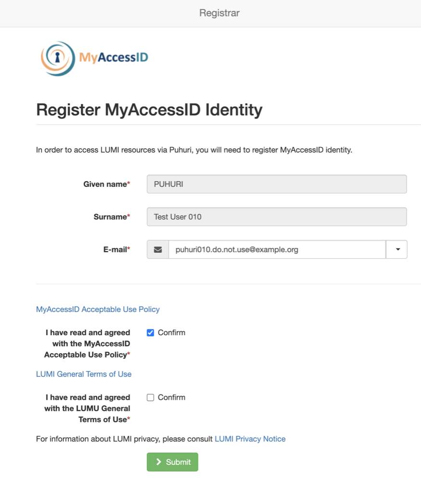
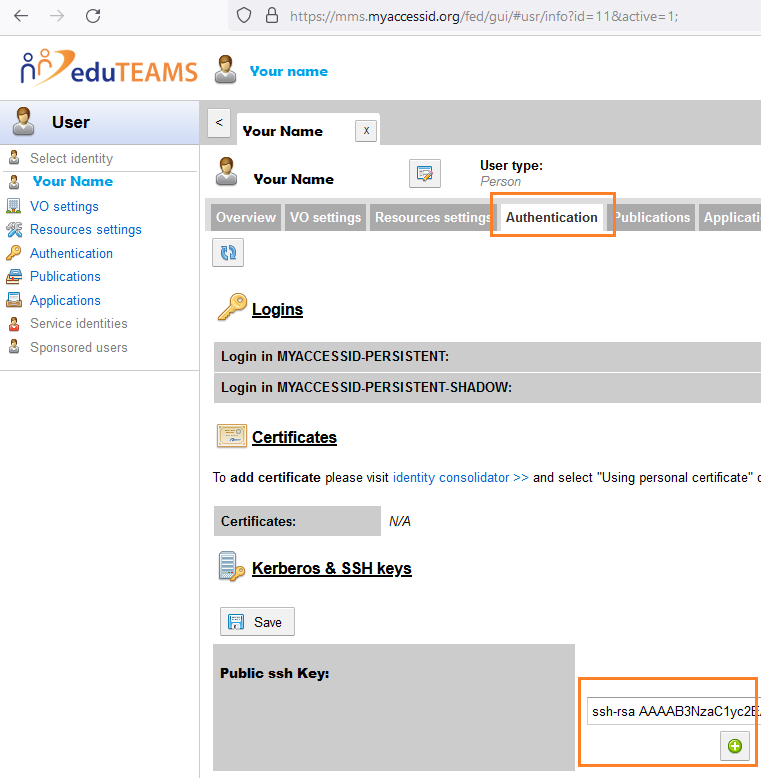

---
hide:
  - navigation
---

!!! warning
    This page is still a draft!
    

# Where to start the process?

LUMI Countries have different kind of portals. Please contact your local contacts to get the URL.
The portals will lead you to MyAccessID registration page, where you have to accept Acceptable Use Policy and LUMI Terms of Use document, which is linked there. Please read it carefully! 

<figure>
  
  <figcaption>MyAccessID Registration portal</figcaption>
</figure>

 
You may also modify the email address, but according to [LUMI Terms of Use](https://www.lumi-supercomputer.eu/lumi-general-terms-of-use_1-0/) you must your organisational email address.

The authentication on the portal done with home organisation identity provider, which can be selected from the list. 
In case that is not possible please [contact LUST team](https://lumi-supercomputer.eu/user-support/need-help/account/) with the error message and you may also contact your identity provider directly.

Accessing LUMI will happend with ssh key pair. 


After registering the key, there can be couple of hours delay until it is sychronised.


You also need to be a member of a project. Project's PI will create a project and invite members via email address. Resource allocator of each country will accept the project.
When the project is accepted the user accounts will be created in LUMI. You will receive email from CSC's Identity management system informing your localt project ID and user account.

# SSH key pair 
 
<figure>
  
  <figcaption>MyAccessID Own profile information to add ssh public key.</figcaption>
</figure>


After registration, you need to register PUBLIC ssh key in your [user profile](https://mms.myaccessid.org/fed/gui/) . From there, the public key will be copied to LUMI with some delay according to the synchronisation schedule. The instructions to create ssh key pair is below.

## Setting up SSH keys

!!! warning "Note"
    The private key should never be shared with anyone, not even with
    CSC staff. It should be also stored only in the local computer (Public key
    can be safely stored in cloud services). Protect it with a good password!

An SSH key pair can be generated in the Linux, macOS, Windows PowerShell and MobaXterm terminal as follows. For Putty, see [PuTTy SSH keys instructions](#ssh-keys-with-putty) below.

It is important to create with enough long key length as following:

```bash
ssh-keygen -t rsa -b 4096
```

You will be prompted for a file name and location where to save the
key. Accept the defaults by pressing ENTER.

Next, you will be asked for a passphrase. Please choose a secure
passphrase. It should be at least 8 characters long and should contain
numbers, letters and special characters. **Important:** Do not leave
the passphrase empty.

### SSH key file with not-default name or location
If you want to store your key in not default location (something else than `~/.ssh/id_rsa`), set the key location in `~/.ssh/config` file.
 
### SSH keys with MobaXterm
At least with Windows operating system, before generating the SSH key, set permanent home directory where to store the SSH key and other settings, so that they are available after closing MobaXterm: `Settings -> Configuration -> General`

### SSH keys with PuTTy
If you are using `PuTTY`, follow these steps to set up SSH keys and to enable SSH tunneling.  

Generate and save public and private SSH keys with passhphrase using [`PuTTygen`](https://www.puttygen.com/#How_to_use_PuTTYgen). Optionally, if you created the keys using Powershell or `ssh-keygen`, convert the private key to PuTTy's format (*Load an existing private key file, Save private key*). 

When starting a connection with `PuTTY`, select the private key file in **Connection > SSH > Auth**. Save the session, so that the settings can be utilized automatically everytime you connect.
