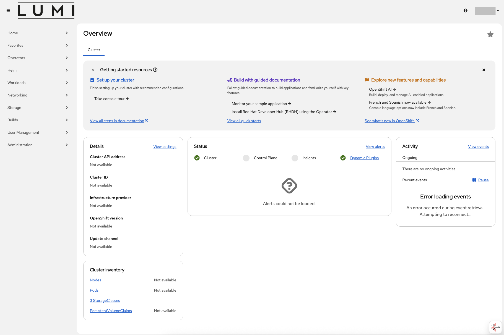

# LUMI-K projects vs LUMI projects

All applications deployed in LUMI-K run within **projects** (also known as Namespaces) that can be
created by any authenticated user. It is important differentiate **LUMI-K projects** and **LUMI projects**.
You can think about a LUMI project as an umbrella for all your LUMI-K projects. When creating a LUMI-K project,
you will be asked to provide the LUMI project number to be associated with it. You need to have at least one active
LUMI project to be able to log in to LUMI-K and create LUMI-K projects. One LUMI project can be associated with multiple
LUMI-K projects. Users can only see LUMI-K projects created by themselves or by their LUMI project team members.

# Login to LUMI-K

1. Create a LUMI project by following these [instructions](../../../firststeps/accessLUMI.md), note that you do not 
need to configure an SSH key to start using LUMI-K . If you already have a LUMI project used for accessing other LUMI 
services (e.g., LUMI-G and LUMI-O), you can skip this step as you will already have default access to LUMI-K.

2. Log in to LUMI-K at [https://console.lumi-k.eu/](https://console.lumi-k.eu/). Choose HAKA, CSC, or Puhuri depending on your organization. 

!!! Warning "User not found"
    If you get an error message similar to this please make sure to create a LUMI project as described in the previous step.
    If you have just created a LUMI project, it might take up to 10 minutes for your profile information to be synced to LUMI-K.
    

After logging in you should see a page like this:

3. If not done yet, proceed to [create a project](03_lumik_projects.md) for running your applications.
