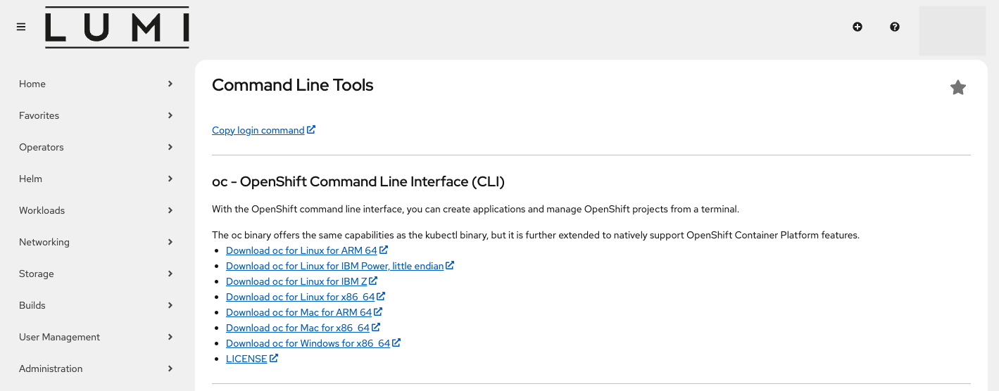
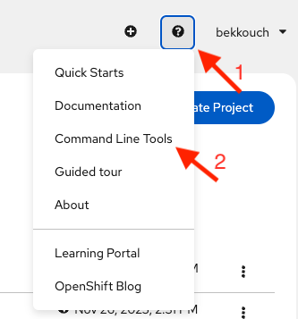
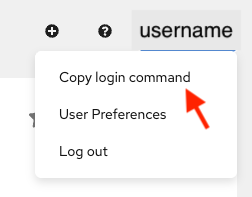

# Command line tool usage

LUMI-K can be used via the command line either with OpenShift's `oc` tool
or with the `kubectl` tool from Kubernetes. Certain features specific to OpenShift
are only available when using the oc tool.

## The "Command Line Tools" page in the LUMI-K web UI

The `oc` tool is a single binary that only needs to be included in your `PATH` environment variable . 
Instructions for downloading the oc tool including the download link for several platforms and operating systems can be
found in [Command Line Tools](https://console.lumi-k.eu/command-line-tools) page in the LUMI-K web interface:



You can also visit the command line tools page using the help menu in the top right corner of the web interface 



Download the necessary package and copy it in your `PATH`.

In order to test that it was properly installed, open a new terminal, go to any folder, and run:

```
$ oc --help
```

It should show the list of all available commands.

## How to login with `oc`?

It is possible to copy the login command directly from the web console of LUMI-K by clicking the dropdown menu next to
the username in the top right corner.



As an additional security measure, you will be prompted to log in again via the web interface before the command and
token are revealed. Copy the command and paste it in a terminal to start using LUMI-K via the command line. The command looks like:

```bash
oc login  --server=https://api.v1.lumi-k.eu:6443 --token=<secret access token>
```

!!! info "Session lifetime"

    After login, the session will be valid for 24H, after which you need to login again.
    If you open multiple terminals, the login session for oc will be active in all of them.

!!! info "Helm login"
    If you are using Helm and you are not logged in from command line, you might get an error like:
    ```sh
    $ helm ls       
    Error: Kubernetes cluster unreachable: Get "http://localhost:8080/version": dial tcp 127.0.0.1:8080: connect: connection refused
    ```

## How to login in the registry?

In order to use LUMI-K internal container registry, it is necessary to login separately. Once you login, it is possible to use the client docker to `pull` and `push` from LUMI-K's registry.


### Using personal account

After login with `oc`, it is possible to use the command to generate a token (`oc whoami -t`):

`docker login -p $(oc whoami -t ) -u unused image-registry.apps.2.LUMI-K.csc.fi`

!!! info "sudo use"
    Some docker client setups require to run the `docker` client as root using `sudo`. In this case the `oc login` command needs to also be run using `sudo`. This is because the login information is stored in the user's home directory, only the user that runs `oc login` is logged in to LUMI-K.

    As a general recommendation, it is better to use other "rootless" runtimes like podman, when possible. It is also possible to configure Docker as non-root user. In order to do so, in most Linux distributions, you just need to type this command: 

    If you have installed `docker.io`:
    
    ```sh
    sudo usermod -aG docker $USER
    ```

    If you have installed Docker Snap (> Ubuntu 22):

    ```sh
    sudo addgroup --system docker
    sudo adduser $USER docker
    newgrp docker
    sudo snap disable docker
    sudo snap enable docker
    ```

    And then log out and log back to have the group membership re-evaluated.


### Using a service account token

LUMI-K also offers the opportunity of using an internal service account to interact with the registry. This is recommended for automated procedures like a CI pipeline. Even though by default 3 internal service accounts are created in every LUMI-K namespace: builder, default and deployer, it is recommended to create a dedicated internal service account and assign to it the `system:image-pusher` role.

```sh
oc create serviceaccount pusher
oc policy add-role-to-user system:image-pusher -z pusher
docker login -p $(oc create token pusher) -u unused image-registry.apps.2.LUMI-K.csc.fi
```

Use the command `oc create token` to generate a new token for the service account.

For example, you can run `oc create token pusher --duration=87600h` to create a token valid for 10 years.

## CLI cheat sheet

**Basic usage:**

```bash
oc <command> <--flags>
oc help <command>
```

**Examples:**

List LUMI-K projects:

```bash
oc projects
```

Switch the context to project `my-project`:

```bash
oc project my-project
```

Show all pods in the current project:

```bash
oc get pods
```

Show all pods in a specific project `<my-other-name-space>`:

```bash
oc get pods -n <my-other-project>
```

Show all pods that have the key-value pair `app: myapp` in `metadata.labels`:

```bash
oc get pods --selector app=myapp
```

Print the specifications of the pod `mypod` in YAML

```bash
oc get pod mypod -o yaml
```

Create any kubernetes object from its YAML definition:

```bash
oc create -f my-object.yaml
```

### Other useful commands

* `oc replace` replaces an object. Example: `oc replace -f file.yaml`
* `oc delete` deletes an object . Example: `oc delete pod my-pod-name`
* `oc apply` update/create an object using its YAML definition . Example `oc apply -f file.yaml`
* `oc explain` prints out the YAML definition structure of a given object. Example: `oc explain pod`
* `oc edit` open an editor for updating an object YAML definition. Example: `oc edit Deployment my-deploy`

## Abbreviations

Object types have abbreviations that are recognized in the CLI:

|Abbreviation |Meaning|
|-----:|:-------|
|`is`|`ImageStream`|
|`svc`|`Service`|
|`bc`|`BuildConfig`|
|`rc`|`ReplicationController`|
|`pvc`|`PersistentVolumeClaim`|

## Further documentation

See the official documentation for more information about using the command line
interface:

* [OpenShift documentation: CLI reference](https://docs.redhat.com/en/documentation/openshift_container_platform/4.19/html-single/cli_tools/index)
