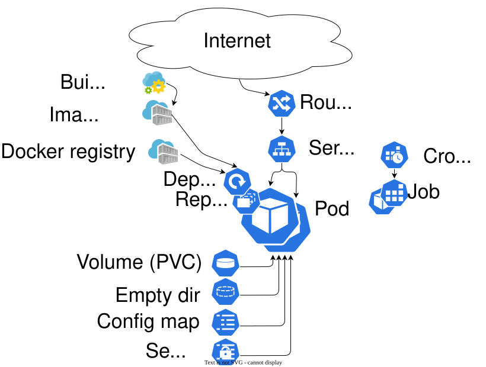
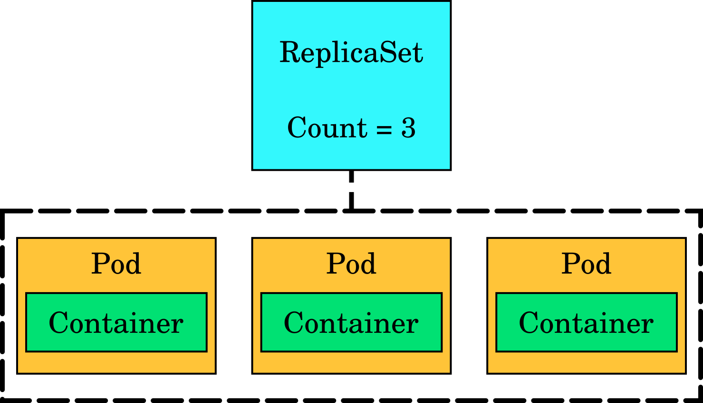

# Kubernetes and OKD concepts

LUMI-K is a container orchestration platform based on Kubernetes and OKD, thus understanding their core concept is a
prerequisite before deploying your applications to LUMI-K.

The power of Kubernetes lies in the relatively simple abstractions it provides for complex tasks such as load balancing, 
software updates, and autoscaling for distributed applications. Here, we give a very brief overview of some of the most important 
abstractions, but we highly recommend that you also read the concept documentation for Kubernetes and OKD.

* [Kubernetes concepts](https://kubernetes.io/docs/concepts/)
* [OKD concepts](https://docs.okd.io/latest/applications/index.html)


Kubernetes uses a declarative model to manage the state of applications deployed in users' projects (also known as 
Namespaces). At the core of this model are objects, which are persistent records of intent. Each object describes a 
specific piece of the application desired state, such as how many replicas an application should have, what network 
rules apply, or what storage a workload requires. Most of the objects are common to both plain Kubernetes and OKD,
but OKD also introduces some of its own extra objects.

Object intents are provided to Kubernetes by submitting object definitions, usually written in YAML or JSON. 
These definitions describe the desired state of the object, and Kubernetes continuously works to make the actual state 
of the system match what is specified. YAML is the format most commonly used by humans. It is easier to read because it 
relies on indentation and also allows comments, which makes it suitable for documentation and configuration written by 
users. JSON is also fully supported by Kubernetes. It is more compact but less readable for humans and does not allow 
comments. However, JSON is typically used by tools, scripts, or APIs rather than directly edited by users.




## Kubernetes objects

Hereafter, we describe some of the objects that are commonly used when deploying applications in a Kubernetes cluster 
like LUMI-K.

### Namespace

A Kubernetes namespace is a logical grouping of objects within a cluster. It provides a way to isolate cluster 
resources among multiple users, teams, or applications. Namespaces help achieve separation and organization without 
requiring multiple physical clusters. Namespaces are used for:

* Grouping a set of objects (Pods, Services, Deployments, etc.).

* Providing isolation for names: two objects in different namespaces can have the same name.

* Applying resource quotas, access controls, and network policies.

In LUMI-K, you will primarily work with projects rather than namespaces. A project is an OKD abstraction built on 
top of a Kubernetes namespace, adding additional metadata and access-control features. However, 
the terms _project_ and _namespace_ are often used interchangeably, as both refer to the logical grouping of a 
user’s resources.

The first step when starting with LUMI-K is to create a project (also known as a namespace). 
In order to create a project in LUMI-K, please refer to the [Creating a project](../01_getting-started/03_lumik_projects.md#creating-a-project) section of the documentation.

### Pod

A Pod is the basic execution unit in Kubernetes. It represents one or more containers that are deployed together, 
scheduled onto the same node, and share certain resources such as networking and storage. All containers in a Pod use 
the same IP address and can communicate with each other through localhost. They can also share mounted storage volumes 
when needed. 

In most cases, a Pod contains a single container. Additional containers, often called sidecars, can be added to provide 
supporting functions like logging, data synchronization, or proxying.

Pods are designed to be temporary. If a Pod fails or its hosting node becomes unavailable, Kubernetes may create a new Pod to 
replace it. Because of this, Pods are usually wrapped and managed by persistent higher-level objects such as Deployments or 
StatefulSets, which ensure the correct number of specific Pods is always running. Moreover, any data generated or modified 
by a Pod should be stored on a [persistent volume](03_storage/02_persistent_storage.md) attached to the Pod.


```yaml
---
apiVersion: v1
kind: Pod
metadata:
  name: name
  namespace: my-namespace
  labels:
    app: my-app
spec:
  containers:
  - name: webserver
    image: cscfi/nginx-okd
    ports:
    - containerPort: 8080
      protocol: TCP
    volumeMounts:
    - name: website-content-volume
      mountPath: /usr/share/nginx/html
  volumes:
  - name: website-content-volume
    persistentVolumeClaim:
      claimName: web-content-pvc
```

The above YAML representation describes a web server pod that has one container
and one volume and exposes the port 8080. You could put this snippet of text
in a file and create a pod that runs NGINX by feeding that file to the Kubernetes API.

### Service

A Kubernetes Service is an abstraction that provides a stable way to access a group of Pods. Because Pods are temporary
and can be replaced at any time, their IP addresses change. A Service solves this by giving the group of Pods a 
consistent virtual IP and DNS name. The Service automatically keeps track of which Pods should receive traffic, 
based on labels, and forwards traffic to them, acting as  **load balancers**. This allows applications to communicate 
with each other reliably even as individual Pods are replaced, restarted, or scaled.


The following YAML definition creates a service object that points to all pods with label **app: my-app** :

```yaml
apiVersion: v1
kind: Service
metadata:
  labels:
    app: my-svc
  name: my-service
spec:
  ports:
  - name: 8080-tcp
    port: 8080
    protocol: TCP
    targetPort: 8080
  selector:
    app: my-app
  sessionAffinity: None
  type: ClusterIP
```


#### Ports 
- The `ports` field in a Kubernetes Service defines the network ports that the Service will expose to clients and how it maps those to the corresponding ports on the Pods.

- It typically consists of several components:
  - **Name**: A label for the port, which can help identify it.
  - **Port**: The port number that clients will use to access the Service.
  - **Protocol**: The communication protocol used (usually TCP).
  - **TargetPort**: The port on the pod where the Service directs traffic.

#### Selector
- The `selector` field in a Kubernetes Service is crucial for determining which pods the Service should route traffic to.

- It consists of key-value pairs that match the labels assigned to the pods. The Service uses these labels to identify and connect to the appropriate pods dynamically.

- **Key Value Pair (`app: my-app`)**: This means that the Service will route traffic to any pods that have a label matching `app: my-app`.

- **Functionality**: This allows the Service to connect to all relevant pods automatically. If any pods with this label are added or removed, the Service will adjust its routing accordingly, ensuring that traffic is always directed to the correct pods.


### ReplicaSet

A **ReplicaSet** ensures that `n` copies of a Pod are running. If one of the
Pods dies, the ReplicaSet ensures that a new one is created in its place. They
are typically not used on their own but rather as part of a **Deployment** object.



### Deployment

**Deployments** manage rolling updates for an application. They typically
contain a ReplicaSet which in its turn contains several pods. If you make a change that requires an
update such as switching to a newer image for Pod containers, the deployment
ensures the change is made in a way that there are no service interruptions. It
will perform a rolling update to kill all pods one by one and replace them with
newer ones while making sure that end user traffic is directed towards working
Pods at all times.


### InitContainer

_InitContainer_ is a container in a Pod that is intended run to completion before
the main containers are started. init containers are used for tasks that must complete first, such as preparing files,
generating configuration, or checking dependencies. Data from the init containers can be transferred to the main 
container using e.g. volume mounts. 


*`pod-init.yaml`*:

```yaml
apiVersion: v1
kind: Pod
metadata:
  name: example-pod
spec:
  initContainers:
  - name: init-permissions
    image: busybox
    command: ["sh", "-c", "mkdir -p /workdir/data && chmod 755 /workdir/data"]
    volumeMounts:
    - name: workdir
      mountPath: /workdir

  containers:
  - name: main-app
    image: nginx:latest
    volumeMounts:
    - name: workdir
      mountPath: /usr/share/nginx/html

  volumes:
  - name: workdir
    emptyDir: {}
```

The Pod definition above contains one init container and one main container. The init container named `init-permissions` 
runs before the main container starts. In this example, the init container creates a directory and sets permissions 
inside a shared volume mounted at `/workdir`. Only when the init container finishes successfully does Kubernetes start
the main container, which in this case runs Nginx. The main container mounts the same shared volume at 
`/usr/share/nginx/html`, so it can use the directory created by the init container.

### StatefulSet

Most Kubernetes objects are stateless. This means that they may be deleted and recreated, and the application should be
able to cope with that without any visible effect. For example, a Deployment defines a Pod with 5 replicas and a 
Rolling release strategy. When a new image is deployed, Kubernetes will kill one by one all Pods, recreating them with 
different names and possibly in different nodes, always keeping at least 5 replicas active. For some application this is
not acceptable, for this use case, Stateful sets have been created.

Like a Deployment, a StatefulSet defines Pods based on container specification. But unlike a Deployment, a StatefulSet 
gives an expected and stable identity, with a persistent identifier that it is maintained across any event 
(upgrades, re-deployments, ...). A stateful set provides:

* Stable, unique network identifiers.
* Stable, persistent storage.
* Ordered, graceful deployment and scaling.
* Ordered, automated rolling updates.

*`statefulSet.yaml`*:

```yaml
apiVersion: apps/v1
kind: StatefulSet
metadata:
  name: web
spec:
  selector:
    matchLabels:
      app: nginx # has to match .spec.template.metadata.labels
  serviceName: nginx
  replicas: 3 # If omitted, by default is 1
  template:
    metadata:
      labels:
        app: nginx # has to match .spec.selector.matchLabels
    spec:
      terminationGracePeriodSeconds: 10
      containers:
      - name: nginx
        image: openshift/hello-openshift
        ports:
        - containerPort: 8888
          name: web
        volumeMounts:
        - name: www
          mountPath: /usr/share/nginx/html
  volumeClaimTemplates:
  - metadata:
      name: www
    spec:
      accessModes: [ "ReadWriteOnce" ]
      storageClassName: "standard-csi"
      resources:
        requests:
          storage: 1Gi
```

### Jobs

A Kubernetes Job is used to run tasks that are meant to finish successfully rather than run continuously. 
Unlike Deployments, which keep applications running, a Job ensures that a specific task runs to completion. 
It creates one or more Pods, monitors their execution, and considers the Job complete when the Pods finish with a 
successful exit code. If a Pod fails, the Job can automatically retry it based on its configuration. 
Jobs are typically used for batch processing, data preparation, cleanup tasks, report generation, and other workloads 
that run once and then exit.


*`job.yaml`*:

```yaml
apiVersion: batch/v1
kind: Job
metadata:
  name: example-job
  namespace: my-namespace
spec:
  template:
    spec:
      containers:
      - name: data-processor
        image: busybox
        command: ["sh", "-c", "echo 'Processing data...' && sleep 5 && echo 'Done'"]
      restartPolicy: Never
  backoffLimit: 3
```

The example above defines a task that runs a single container to perform a short operation. The container uses the 
busybox image and executes a command that prints a message, waits for a few seconds, and then prints another message 
before exiting. The Job is configured so that the Pod running it will not be restarted by Kubernetes
(`restartPolicy: Never`) in the event of failure . Instead, if the task fails, Kubernetes will create a new Pod to retry
it. The line `backoffLimit: 3` specifies that Kubernetes will attempt this task up to three additional times if it does 
not succeed on the first run.

There may only be one object with a given name in the project namespace, thus the  job cannot be run twice unless its first instance is removed. The pod,
however, does not need to be cleaned, it will be removed automatically in cascade after the Job is removed.

### ConfigMap

**ConfigMaps** are useful in storing configuration type data in Kubernetes
objects. Their contents are communicated to containers by environmental
variables or volume mounts. Below is an example of a ConfigMap object definition, that stores three configuration items,
`data.prop.a`, `data.prop.b`, and `data.prop.long`.


*`configmap.yaml`*:

```yaml
kind: ConfigMap
apiVersion: v1
metadata:
  name: my-config-map
  namespace: my-namespace
data:
  data.prop.a: hello
  data.prop.b: bar
  data.prop.long: |-
    fo=bar
    baz=notbar
```


#### Use a ConfigMap

After creating a ConfigMap, it is possible to create a pod that imports its configuration items as environment variables
inside the Pod's containers. The Pod in the example below, imports `data.prop.a` to the `DATA_PROP_A`. It is alos 
possible to inject the configuration items of a ConfigMap to the Pod's containers as mounted files. In the example below,
the configuration items of the ConfigMap  `my-config-map` are mounted as separate files at `/etc/my-config`. 


*`configmap-pod.yaml`*:

```yaml
kind: Pod
apiVersion: v1
metadata:
  name: my-config-map-pod
  namespace: my-namespace
spec:
  restartPolicy: Never
  volumes:
  - name: configmap-vol
    configMap:
      name: my-config-map
  containers:
  - name: confmap-cont
    image: perl
    command:
    - /bin/sh
    - -c
    - |-
      cat /etc/my-config/data.prop.long &&
      echo "" &&
      echo DATA_PROP_A=$DATA_PROP_A
    env:
    - name: DATA_PROP_A
      valueFrom:
        configMapKeyRef:
          name: my-config-map
          key: data.prop.a
    volumeMounts:     
    - name: configmap-vol
      mountPath: /etc/my-config
```


### Secret

Secrets behave much like ConfigMaps, with the difference that the value of configuration items are *base64* encoded, 
and their plain content is not displayed by default when inspecting the Secret objects.

*`secret.yaml`*:

```yaml
apiVersion: v1
kind: Secret
data:
  secret-config: V2VsY29tZSB0byBMVU1JLUsK
metadata:
  name: my-secret
  namespace: my-namespace
```

##  OKD extensions

OKD includes all Kubernetes objects, plus some extensions:

* **BuildConfig** objects build container images
  based on the source files.
* **ImageStream** objects abstract images and
  enrich them to streams that emit signals when they see that a new image is
  uploaded into them by e.g. BuildConfig.
* **Route** objects connects a **Service** with the internet using _HTTP_.


### ImageStream

[ImageStreams](https://docs.okd.io/latest/openshift_images/image-streams-manage.html) store images. They simplify
the management of container images and can be created by a BuildConfig or the user when a new images are uploaded to the
 image registry.

A simple ImageStream object:

*`imagestream.yaml`*:

```yaml
apiVersion: image.openshift.io/v1
kind: ImageStream
metadata:
  labels:
    app: serveapp
  name: custom-httpd-image
  namespace: my-namespace
spec:
  lookupPolicy:
    local: false
```

### BuildConfig

[BuildConfig](https://docs.okd.io/latest/cicd/builds/understanding-image-builds.html) objects 
create container images according to specific rules. In the following example, the _Docker_ strategy is used to build a customized version
of the `httpd` web server container image shipped with OKD.

*`buildconfig.yaml`*:

```yaml
kind: "BuildConfig"
apiVersion: build.openshift.io/v1
metadata:
  name: custom-httpd-build
  namespace: my-namespace
  labels:
    app: serveapp
spec:
  runPolicy: Serial
  output:
    to:
      kind: ImageStreamTag
      name: custom-httpd-image:latest
  source:
    dockerfile: |
      FROM image-registry.openshift-image-registry.svc:5000/openshift/httpd
  strategy:
    type: Docker
```

After creating the build object (here named `custom-httpd-build`), you need to trigger "Start build" from web console. Alternatively, you can use the following command to start a build process.

```sh
oc start-build custom-httpd-build
```


### Route

Route objects are the OKD equivalent of _Ingress_ in vanilla Kubernetes, they expose a Service object to the 
internet via HTTP/HTTPS. A typical Route definition would be:

```yaml
apiVersion: route.openshift.io/v1
kind: Route
metadata:
  name: my-route
  namespace: my-namespace
spec:
  host: my-route.apps.lumi-k.eu
  to:
    kind: Service
    weight: 100
    name: my-service
  tls:
    insecureEdgeTerminationPolicy: Redirect
    termination: edge
status:
  ingress: []
```

This will redirect any external traffic (from internet) coming to `my-route.apps.lumi-k.eu` to the service `my-service`.

* `insecureEdgeTerminationPolicy` is set to `Redirect`. This means that any traffic coming to port 80 (HTTP) will be redirected to port 443 (HTTPS).
* `termination` is set to `edge`, This means that the route will manage the TLS certificate and decrypt the traffic sending it to the service in clear text. 
Other options for `termination` include `passthrough` or `reencrypt`.

All route that have `.spec.host` set to avalue with the pattern `*.apps.lumi-k.eu`, will automatically have a 
**DNS record** and a valid **TLS certificate**. It is possible to configure a Route with any given hostname, 
but a `CNAME` pointing to `router-default.v1.apps.lumi-k.eu` must be configured, and a **TLS certificate** must be provided. 
See the [Custom domain names](04_networking.md#custom-domains) page for more information.

!!! info "Default host value"
    If `.spec.host` is not set,  it defaults to `.metadata.name` + `-` + `namespace` + `.apps.lumi-k.eu`.
