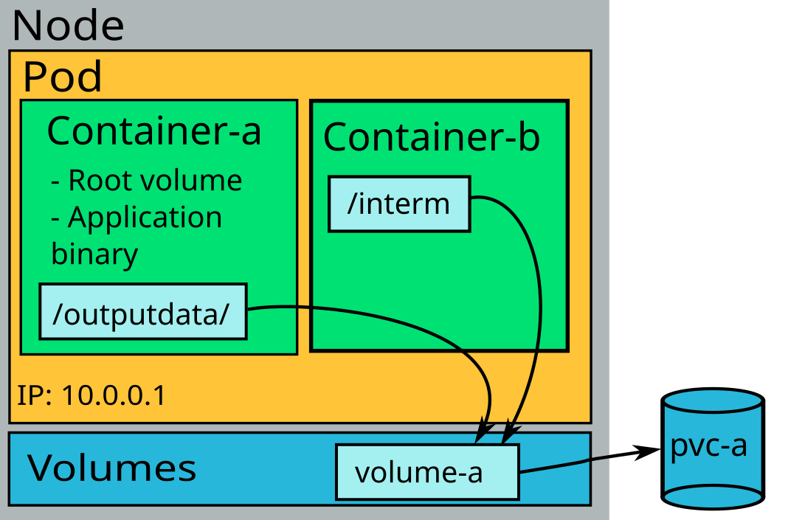
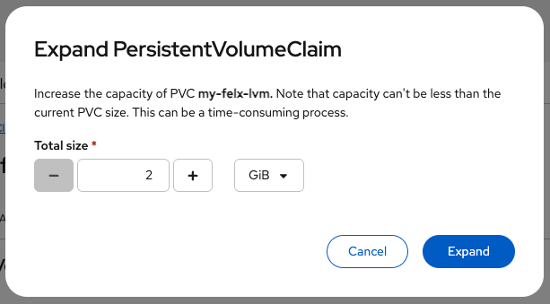

# Persistent Storage

Many applications running in Kubernetes require data that must survive Pod restarts, rescheduling, failures, or upgrades.
Kubernetes provides persistent storage to ensure that data is stored independently of the Pod lifecycle. 
This is essential for databases, message queues, and stateful applications. 

Persistent storage in Kubernetes is built around three key concepts: **PersistentVolumes (PVs)**, 
**PersistentVolumeClaims (PVCs)**, and **StorageClasses**.




## PersistentVolumes (PVs)

A PersistentVolume (PV) represents a piece of storage provisioned at the cluster-level  (i.e., PVs are not bound to a 
specific namespace, a.k.a LUMI-K project). In LUMI-K, users do not create PVs directly, instead, PVs are typically 
created automatically by a **StorageClass** provisioner designated by users in their **PersistentVolumeClaims**. A
PersistentVolume contains information such as storage capacity and access modes (e.g., Read-Write-Once or Read-Write-Many).


## PersistentVolumeClaims (PVCs)

A PersistentVolumeClaim (PVC) is the object that users create to request storage. A PVC specifies the desired storage 
capacity, the access mode, and the StorageClass used to create the corresponding PV.

Example PVC:

```yaml
apiVersion: v1
kind: PersistentVolumeClaim
metadata:
  name: my-data
spec:
  accessModes:
    - ReadWriteMany
  resources:
    requests:
      storage: 5Gi
  storageClassName: rook-ceph-fs
```

Once bound to its PV, a PVC can be mounted inside a Pod as follows:

```yaml
apiVersion: v1
kind: Pod
metadata:
  name: my-pod
spec:
  containers:
    - name: app
      image: nginx:latest
      volumeMounts:
        - name: data-volume
          mountPath: /data
  volumes:
    - name: data-volume
      persistentVolumeClaim:
        claimName: my-data
```


## StorageClasses (SCs)

A StorageClass defines a type of storage available in the cluster, it mainly describes the provisioner responsible for 
the creation PVs and the parameters of the provisioner. StorageClasses are created and managed by cluster-admins 
but normal users can use them to request specific type of storage without knowing the low-level details of the storage 
system. LUMI-K provides three storage classes:

### 1. CephFS StorageClass

CephFS provides volumes as shared POSIX-compatible filesystems that can be mounted by multiple Pods on different
nodes at the same time. It supports standard filesystem operations and is ideal for workloads that require shared access
or hierarchical directories. Use this StorageClass when your application needs:

* Shared access across multiple Pods.
* A filesystem-like structure for storing many files.
* POSIX compatibility (chmod, symlinks, etc.).
* Multi-reader or multi-writer access.

Typical workloads:

* Shared scratch space for compute tasks.
* Web servers needing shared assets.
* Data pipelines requiring shared intermediate files.

Example of a PVC using this StorageClass in LUMI-K:


```yaml
apiVersion: v1
kind: PersistentVolumeClaim
metadata:
  name: shared-data
spec:
  accessModes:
    - ReadWriteMany
  resources:
    requests:
      storage: 5Gi
  storageClassName: rook-ceph-fs
```


### 2. Ceph Block StorageClass

Ceph Block storage provides network-attached block storage devices. These behave like virtual disks and are typically 
mounted by a single Pod at a time. However, in LUMI-K this StorageClass is configured to create a filesystem of type 
`ext4` in the block devices when the PV is provisioned. This means that users still access the block devices as filesystems.
Use this StorageClass when your application needs:

* Single Pod access to the volume.
* Strong consistency with a single writer.
* Database-like workload patterns.

Example of a PVC using this StorageClass in LUMI-K:

```yaml
apiVersion: v1
kind: PersistentVolumeClaim
metadata:
  name: db-data
spec:
  accessModes:
    - ReadWriteOnce
  resources:
    requests:
      storage: 20Gi
  storageClassName: rook-ceph-block

```


### 3. LVM StorageClass

The LVM StorageClass provides local persistent storage using the Logical Volume Manager (LVM) on the LUMI-K worker nodes.
Similar, to Ceph Block StorageClass, LVM enables users to dynamically provision local block volumes backed by physical 
SSD disks on the node instead of Ceph storage. However, in LUMI-K, block volumes created by LVM are formated with `xfs` 
filesystem instead of `ext4`. In addition to all the use cases of the Ceph Block StorageClass, LVM is excellent for 
latency-sensitive workloads where fast, node-local storage is required, without relying on remote storage systems like Ceph.


!!! warning "Note"
    While the LVM StorageClass provides persistent fast storage for Pods, it is less reliable compared to Ceph backed 
    StorageClasses, as data on the local physical disks is not replicated or backed up, and any disk failure will cause
    data loss. Please, use this StorageClass carefully for application requiring fast storage for non-critical data
    similar to [emptyDir](ephemeral_storage.md), with the advantage of volumes surviving Pods restart and deletion. 


Example of a PVC using this StorageClass in LUMI-K:

```yaml
apiVersion: v1
kind: PersistentVolumeClaim
metadata:
  name: local-fast-pvc
spec:
  accessModes:
    - ReadWriteOnce
  resources:
    requests:
      storage: 20Gi
  storageClassName: lvms-local
```

## Putting everything together:

This workflow for creating persistent storage volumes on demand in LUMI-K is as follow: 

1. The user creates a **PersistentVolumeClaim**, referring to a **StorageClass**.
2. The **PersistentVolumeClaim** will be in pending a state until a Pod mount it as volume.
3. The **StorageClass** provisions a new **PersistentVolume** dynamically.
4. The **PersistentVolumeClaim** binds to the created **PersistentVolume**, and its status changes from pending to bound.
5. A volume is attached to the Pod and is ready for use.


!!! warning
    All storage classes in LUMI-K are configured with `reclaimPolicy: Delete`, this means that when a PVC is deleted, 
    its corresponding PV (and thus the data inside it) is **permanently** deleted. It is highly recommended to make 
    regular and versioned copies of the data to an independent storage system like [LUMI-O](../../../../storage/lumio/index.md#lumi-o).

## Expanding volume

All StorageClasses in LUMI-K support dynamic volume expansion, this means that you can increase the size of your PVCs 
(and implicitly their bound PVs) when you need more storage. This can be done by simply increasing the
`.resources.requests.storage` attribute in the YAML defention of your PVC or by using the web user interface at 
Storage -> PersistentVolumeClaims -> <volume-name> -> Actions -> Expand PVC:

