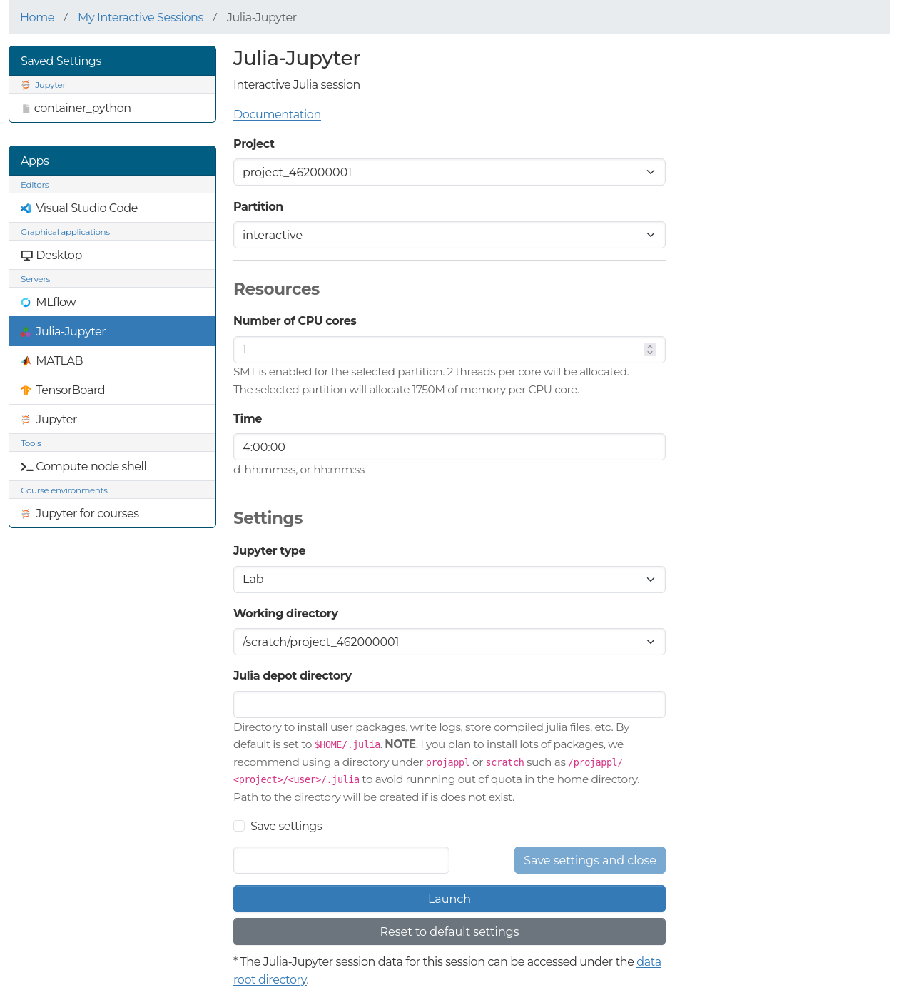
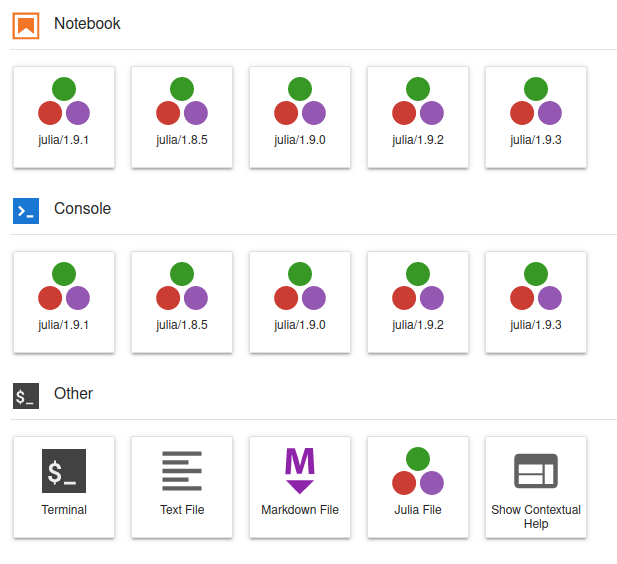

# Julia Jupyter

The Julia-Jupyter app launches Jupyter Lab with support for Julia kernels on a
LUMI compute node, which you can access from the web interface.

## Launching Julia-Jupyter

In the form you will be able to select:

- **Jupyter type**: We recommend using JupyterLab, but the classic notebook is also available.
- **Working directory**: The root directory for Jupyter.
- **Julia depot directory**: Sets the location for package installations, compiled files, and other Julia depots.
    If you plan to install large numbers of Julia packages, we recommend using Projappl or Scratch instead of the home directory as it could run out of quota.
    For example, Plots.jl installs over 10k files and is quite large.



## Starting Julia kernel



When Julia-Jupyter is launched for the first time, there are no Julia kernels available.
To install kernels,  open the *Terminal* application, load the Julia module, and invoke an installation script as follows:

```bash
module load julia
install_ijulia_kernel.jl
```

The script installs [IJulia.jl](https://github.com/JuliaLang/IJulia.jl) and the kernel for the Julia version that was loaded from the module.
Now, we can close the terminal and refresh the Launcher window, and we should see the installed Julia kernel in the notebook menu.
Press the icon to start a Julia notebook.

Note that the Jupyter installation for Julia is separate from the Jupyter installation for Python and is not intended for other use.
