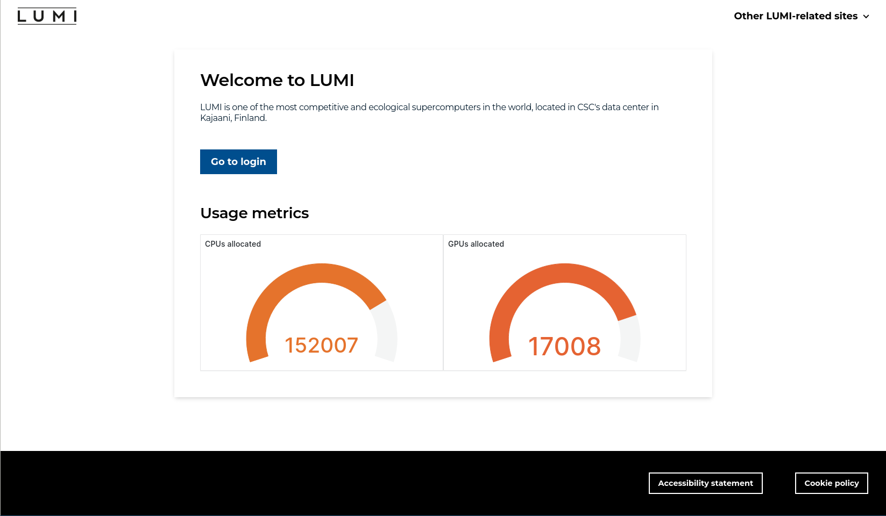
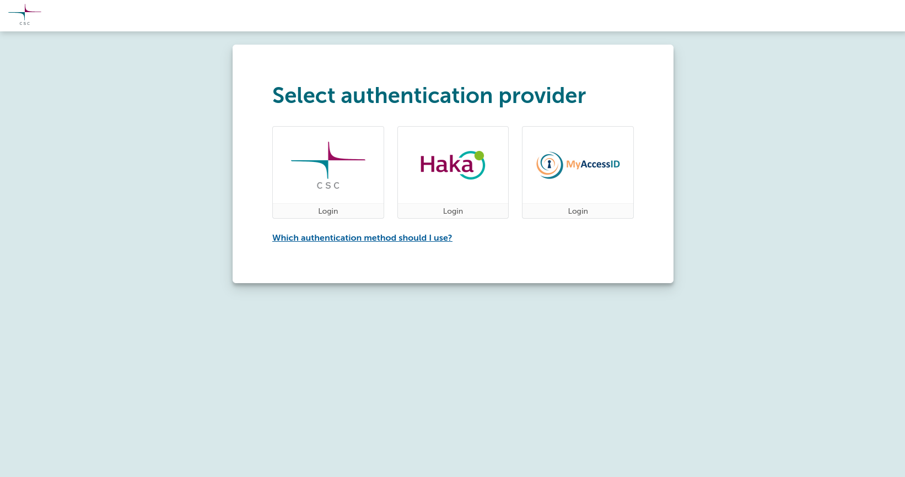
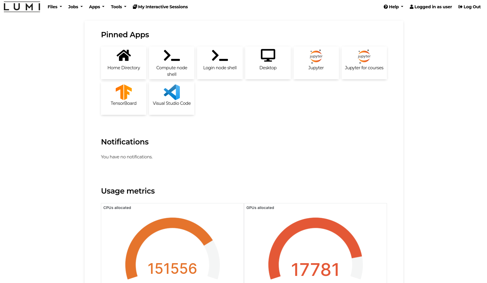

# Logging in (with web interface)

!!! info
	The web interface is still under development, so expect additional features and further polishing.
	Read more about the possibilities with the web interface in the [web interface](../runjobs/webui/index.md) section.

Using a web browser, navigate to [www.lumi.csc.fi](https://www.lumi.csc.fi). 

Click the _Go to login_ button to proceed.

Choose the correct authentication provider which for most LUMI users is _MyAccessID_ (users with a Finnish allocation can also use _CSC_ or _HAKA_), and follow the authentication procedure.

After successful authentication, you will see the dashboard.

Please read more how to use LUMI via the Web interface from the [Web interface](../runjobs/webui/index.md) section. 
