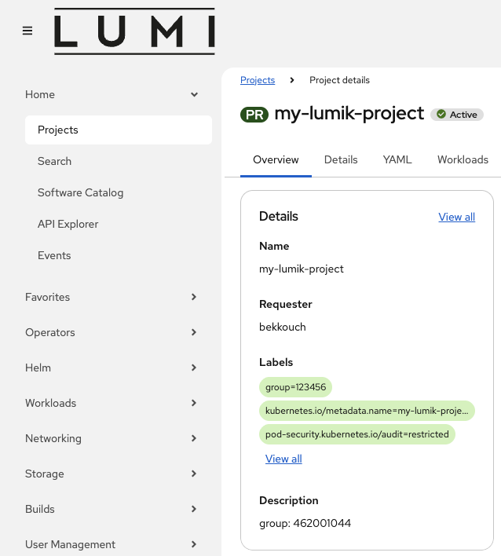
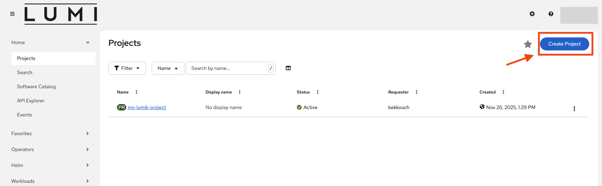
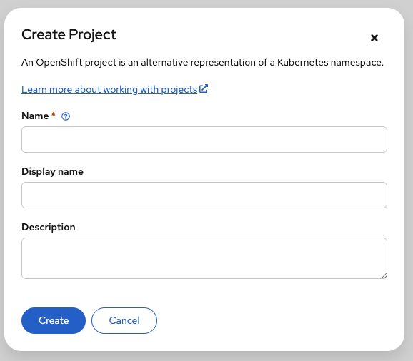
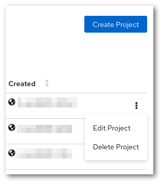
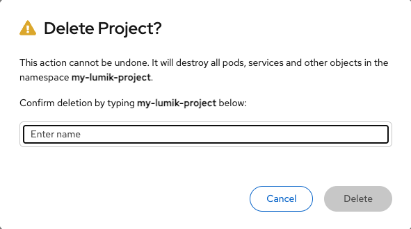

# LUMI-K projects

## LUMI-K projects vs LUMI projects

All applications deployed in LUMI-K run within **projects** (a.k.a namespaces) that can be
created by any authenticated user. It is important to differentiate **LUMI-K projects** and **LUMI projects**.
You can think about a LUMI project as an umbrella for all your LUMI-K projects. When creating a LUMI-K project, 
you must be a member of at least one LUMI project. The LUMI project can be then associated with the
LUMI-K project by specifying its number as  `lumi_project: <lumi_project_number>` in the _Description_ field of project 
creation form in LUMI-K.

For example, if you are already a member of a LUMI project with number 465000001, you can use it to create LUMI-K projects 
by entering the following text in the _Description_ field of the project creation form in LUMI-K:

```
lumi_project: 465000001
```

You can also enter a human-readable description for the project, in which case the field could look like this:

```
This project is used for hosting the Pied Piper web application.
lumi_project: 465000001
```

It is to be noted that one LUMI project can be associated with multiple LUMI-K projects. Also, users can only see LUMI-K
projects created by themselves or by their LUMI project team members. You can check the list of LUMI projects you are a 
member of using the LUMI web interface or by using the`lumi-workspaces` command in the LUMI terminal as described [here](../../lumi_env/dailymanagement.md#lumi-workspaces).

If you would like to know which LUMI project,  a LUMI-K project is associated with, you can do so using the _oc_ command
line tool. You can find instructions for setting up oc in the [command line tool usage instructions ](lumik_cli.md). 
For example, if your LUMI-K project is called *my-lumik-project*, you would run:

```bash
oc get project my-lumik-project -o yaml
```

This should produce the following output:

```yaml
apiVersion: project.openshift.io/v1
kind: Project
metadata:
  annotations:
    ...
  creationTimestamp: 2025-11-22T12:27:05Z
  labels:
    group: "465000001"
  name: my-lumik-project
spec:
  finalizers:
  - kubernetes
status:
  phase: Active
```

In the output above, you can find the associated LUMI project under `.metadata.labels.group`. In this case, 
the project is `465000001`. This information is also available via the LUMI-K web interface.



!!! info

    It is not possible for users to change the *lumi_project* label
    after a project has been created. If you would like to change the label for
    an existing project, please [contact the support](../../../helpdesk/index.md). You can also create
    a completely new project if you want to use a different label.

## Create a new project

1. First, login to LUMI-K console as described [here](lumik_login.md). After being logged in, click the blue 
"Create Project" button as shown bellow:

    

2. The following project creation form will pop-up:

      

    Enter the following information:

    * In the **Name** field, enter a **unique name** that is not in use by any other project
    in LUMI-K.
    * In the **Display name** field, you *can*  enter a **human-readable display name**, but this is optional.
    * In the **Description** field, enter the LUMI project number as instructed in the previous section, `lumi_project: 465000001`.


3. Once you have filled in the fields, click "Create", and you will be redirected to the main project page, showing the details,
list of Kubernetes objects, resource usage, and applied quota of your new LUMI-K project.

## Sharing LUMI-K projects with other users

By default, LUMI-K projects that are associated with a specific LUMI project are accessible to all members of that LUMI 
project. All members automatically have administrative access to the corresponding LUMI-K projects.

If you want to grant a new user access to your LUMI-K projects, the LUMI project PI needs to [invite them to the parent LUMI project](../../../firststeps/accessLUMI.md). The synchronization for the user access can take up to 2 hours.

## Deleting a LUMI-K project

In order to delete a LUMI-K project, you need to go to the main landing page and click in the 3 vertical dots next to the name of the project. In the drop down menu, you will see the option "Delete Project"



Then you will be asked to input the name of the project to prevent accidental deletions.

!!! warning

    After the project has been confirmed for deletion, all resources for that LUMI-K project will be deleted and there will be no way to restore them, including the data stored in the persistent volumes.



After that, LUMI-K will start to delete all the resources of the project. It could take only few seconds or up to a minute, it depends on the amount of resources the project had. After that, LUMI-K will liberate the project name, and it will be possible to create an empty project with the same name.
