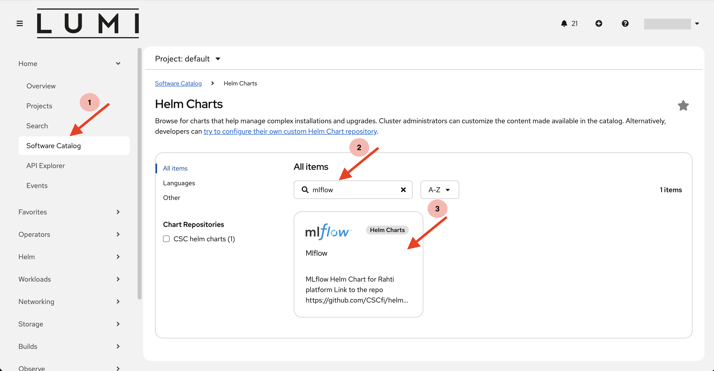
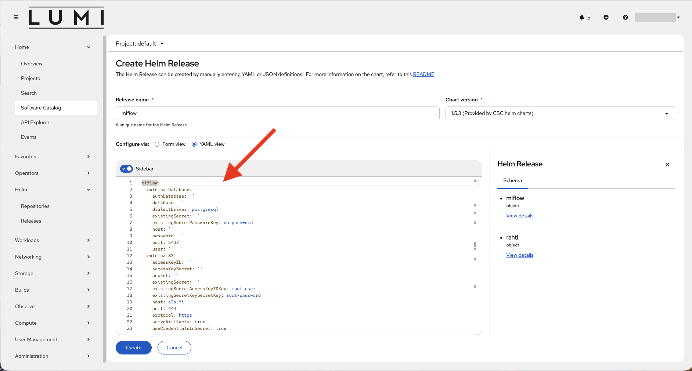

# MLflow

MLflow is an open-source platform designed to streamline the machine learning (ML) lifecycle. It helps data scientists and engineers manage experiments, track model performance, and deploy models efficiently. Its flexibility allows integration with popular ML frameworks like TensorFlow, PyTorch, and Scikit-learn, making it easy to integrate into any ML workflow.

Learn more in the official MLflow documentation:
https://mlflow.org/docs/latest/

## Deploying MLflow in LUMI-K

MLflow in LUMI-K can be deployed using [Helm](https://helm.sh/) either from the LUMI-K web user interface in the Software Catalog or via the Helm CLI. In both cases you can add custom values to override default Helm chart values as explained in the values section.

### Using the Software Catalog

1. Create a project in LUMI-K as explained [here](../getting-started/lumik_projects.md#create-a-new-project).

2. Navigate to MLflow Helm Chart in the LUMI-K Software Catalog:
    - On the menu in the left, click on Software Catalog under the Home section.
    - Search for MLflow in the search box.
    - Click on the MLflow Helm chart.

    

3. Click on the create button. This will open the "Create Helm Release" form.
4. Give a custom name to your Mlflow Helm release in the "Release name" dialogue box. 
5. Under the "configuration via Form view / YAML view" section, you can add your custom values to override the default Helm chart values.

    

6. Click on the create button to install a Helm release.
7. Navigate to Releases under the Helm section on the left-side menu. There you can see the status of your Mlflow release. Make sure you are in the correct LUMI-K project. If everything went well, the status column should show "Deployed".
8. If the MLflow tracking server was exposed via a Route object, navigate to the Routes section under Networking from the left-side menu. Here you can see your route endpoint under the Location column. Use this endpoint to access the MLflow tracking server.

### Using the Helm CLI

1. Install Helm CLI tool in your local workstation following the instructions [here](https://helm.sh/docs/intro/install).
2. Login to LUMI-K using the oc CLI tool as explained [here](../getting-started/lumik_cli.md#how-to-login-with-oc).
3. Create a project in LUMI-K:
    ```bash
    oc new-project <your project name> --description="lumi_project: <lumi_project_number>"
    ```
4. Add the cscfi Helm chart repository:
    ```bash
    helm repo add cscfi https://cscfi.github.io/helm-charts/
    ```
    Make sure we get the latest charts from the repo before proceeding:
    ```bash
    helm repo update
    ```
5. Install the MLflow Helm chart from cscfi repo:
    ```bash
    helm install <your release name> -n <your project name> cscfi/mlflow 
    ```
    You can add your custom values to override the default chart values using the `--set` option in the above command. If there are multiple custom values, you can put all the custom values in a single values.yaml file and refer to it in the above command using the `-f values.yaml` option.
6. To check the status of the Helm deployment:
    ```bash
    helm status <your release name> -n <your project name>
    ```
    The status field should show "Deployed" in case of a successful Helm deployment.
7. If the Mlflow tracking server was exposed via a Route object, use the following command to get the tracking server endpoint:
    ```bash
    oc get route/mlflow-tracking --namespace=<your project name> -o jsonpath='{.spec.host}'
    ```


### Overriding the Default Values
The MLflow Helm chart from cscfi (and the dependent Mlflow chart from Bitnami) have multiple default values that can be overriden by the end user according to their requirements. Some of the common replaced values are explained below:

#### Database:
Using a database as the MLflow backend store provides a scalable, reliable, and query-efficient foundation for experiment tracking and model lifecycle management. The Mlflow Helm chart has Bitnami PostgreSQL Database Helm chart as a dependency which can be enabled if the following value is set:
    ```bash
    mlflow.postgresql.enabled=true
    ```
However, for production environments it is recommended to use an external database instance which have standard enterprise capabilities such as backups, and high availability. To use an external database, the following values need to be set:
    ```bash
    mlflow.externalDatabase.host={DB_PUBLIC_IP}
    mlflow.externalDatabase.user={DB_USER}
    mlflow.externalDatabase.password={DB_PASSWORD}
    mlflow.externalDatabase.database={DB_NAME}
    ```

#### s3 Storage Backend:
Using an object store such as LUMI-O via s3 as the MLflow artifact storage backend provides durable, highly available, and virtually unlimited storage for large model artifacts, datasets, and logs. It centralizes artifact management for all experiments and environments, enabling scalable, cost‑effective retention and easy sharing of artifacts across teams and infrastructure.

The MLflow helm chart values that need to be set for s3 connection with LUMI-O are as follows:
    ```bash
    mlflow.externalS3.host=lumidata.eu
    mlflow.externalS3.accessKeyID={ACCESS_KEY}
    mlflow.externalS3.accessKeySecret={SECRET_KEY}
    mlflow.externalS3.bucket={BUCKET_NAME}
    tracking.extraEnvVars[0].name=AWS_REQUEST_CHECKSUM_CALCULATION
    tracking.extraEnvVars[0].value=when_required
    tracking.extraEnvVars[1].name=AWS_RESPONSE_CHECKSUM_VALIDATION
    tracking.extraEnvVars[1].value=when_required
    ```

#### Authentication:
MLflow helm chart includes the option to setup HTTP Basic Authentication using NGINX Reverse Proxy. The image for NGINX is build inside the user's LUMI-K project using BuildConfig object. To add users to HTTP Authentication, rahti.buildconfig.auth value which is list need to be appended as shown below:
    ```bash
    rahti.buildconfig.auth[0].user=user
    rahti.buildconfig.auth[0].password=user
    ```

Since there are multiple custom values, it is better to use a single values file rahter than setting them inline. This can be easily done using a `values.yml` file as shown below and refering it to `helm install` command using the `-f` option.

    mlflow:
        externalDatabase:
            host: {DB_PUBLIC_IP}
            user: {DB_USER}
            password: {DB_PASSWORD}
            database: {DB_NAME}
        postgresql:
            enabled: false # true if internal Postgresql is required 
        externalS3:
            accessKeyID: {ACCESS_KEY}
            accessKeySecret: {SECRET_KEY}
            host: "lumidata.eu"
            bucket: {BUCKET_NAME}
        tracking:
            extraEnvVars: 
            - name: AWS_REQUEST_CHECKSUM_CALCULATION
              value: when_required
            - name: AWS_RESPONSE_CHECKSUM_VALIDATION
              value: when_required
    rahti:
        buildconfig:
            auth:
            - user: "user"
              password: "user"
