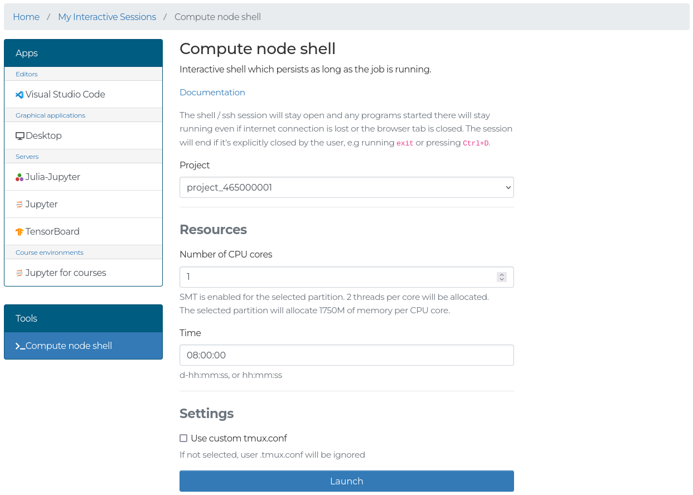
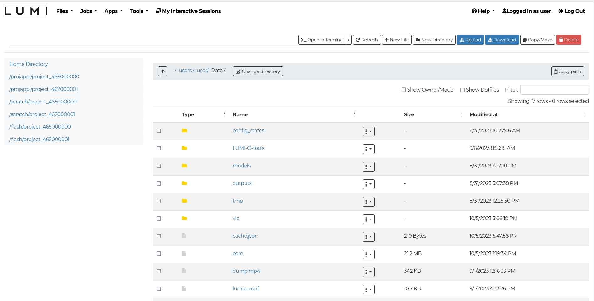

# The LUMI web interface


## Intro

The web interface for LUMI at [www.lumi.csc.fi](https://www.lumi.csc.fi) can be used to access the supercomputer using only a web browser.

Features available in the web interface:

- View, download and upload files
- Open a shell on the login node
- Open a persistent shell on a compute node
- View running batch jobs
- Launch interactive apps and connect to them directly from the browser:
    - Desktop with support for GPU acceleration
    - Julia-Jupyter
    - Jupyter
    - Jupyter for courses: An interactive Jupyter session specifically for courses
    - TensorBoard
    - Visual Studio Code
 
!!! info
	The web interface is still under development, so expect 
	additional features and further polishing. 

## Connecting

See the section in [First steps](../../firststeps/loggingin-webui.md) for how to connect to LUMI using the web interface. 

After connecting, you can browse your files on the supercomputer, start a shell, view running jobs or start one of the many available applications. The dashboard also contains some important system information.

## Available features

### Shell

The shell apps can be found under Pinned apps or on the top navbar under the _Tools_ section.
There are two different shells.

The _Login node shell_ launches a normal Linux shell on one of the login nodes.
Any command running when the login shell browser tab is closed will stop.
Note that the same rules apply here as during a normal ssh session from a terminal.
**Login nodes are only for light pre/postprocessing**. 



The _Compute node shell_ launches a persistent shell on a compute node for heavier commands that should not be run on login nodes.
The persistent shell will keep running even if you close your browser or lose internet connection.

### Files

The file browser can be opened using the _Files_ section on the top navbar (this displays a list of all project disk areas), or using 
the shortcut to the home folder on the front page. In the file browser
you can upload/download files, create new files and directories, or open a shell in the current directory. 

!!! note
    Uploaded files will overwrite existing files with the same name without prompting.
    Currently, the maximum size for individual file uploads is 10GB.
    Keep the tab with the file browser open while file transfers are in progress to ensure that they complete successfully.




Clicking on a file will open it in a view-only mode. For more options like editing, renaming and deleting, use the button with three dots next to the filename.   

The file browser comes with a basic text editor. Some important notes on that:

- If no changes have been made, the _save_ button is grayed out.
- There is no _save-as_ feature, so read-only files cannot be edited.

#### Accessing LUMI-O
[LUMI-O](../../storage/lumio/#lumi-o) can also be accessed if you have
configured the connection, which you can do using the Cloud storage
configuration app, found in the _Pinned apps_ or the _Tools_ dropdown in the
navbar. After configuring the connections, also known as remotes, you can find
them in the _Files_ dropdown in the navbar or in the files browser.

The Cloud storage configuration app will configure a private remote,
`lumi-<project number>-private`, and a public remote, `<lumi-project
number>-public>`, if you have enabled the option. Note that files uploaded to
the public remote will be publicly accessible on the URL:
```
https://<project-number>.lumidata.eu/<bucket_name>
```

Only shortcuts to the project storage spaces in LUMI-O that have valid
authentication credentials will be visible in the file browser, so once the
authentication expires after 7 days, they will no longer be visible.
If you no longer need a configured connection to LUMI-O, you can either delete
the remote, which keeps the authentication credentials valid, or revoke the
remote, which will revoke the authentication credentials.

!!! note
    Uploading from your local computer to LUMI-O directly is currently
    recommended only for small files.

### Active Jobs

The _Active Jobs_ app can be found under the _Jobs_ section in the top navbar.
In the app you will be able to see your currently running and recently completed Slurm jobs.
By expanding the row for the job using the arrow on the left side more details about the job will be visible.


### Interactive applications

For instructions on how interactive applications work,
see the [generic instructions on interactive applications](./interactive-apps.md),
or the applications specific instructions:

- [Desktop](./desktop.md)
- [Julia-Jupyter](./julia-jupyter.md)
- [Jupyter](./jupyter.md)
- [Jupyter for courses](./jupyter-for-courses.md)
- [TensorBoard](./tensorboard.md)
- [Visual Studio Code](./vscode.md)
