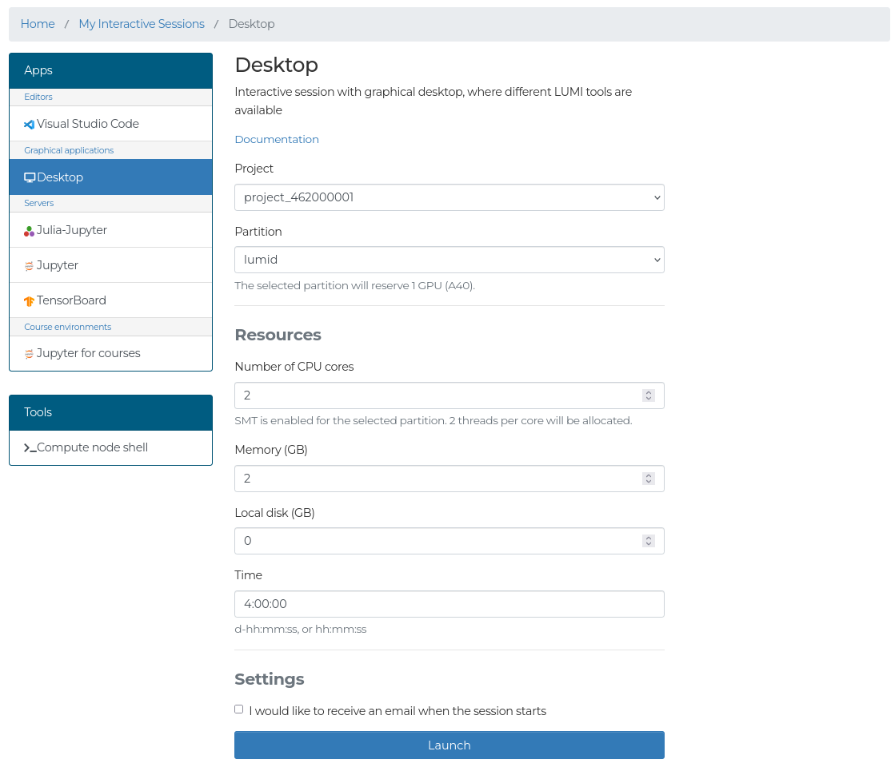
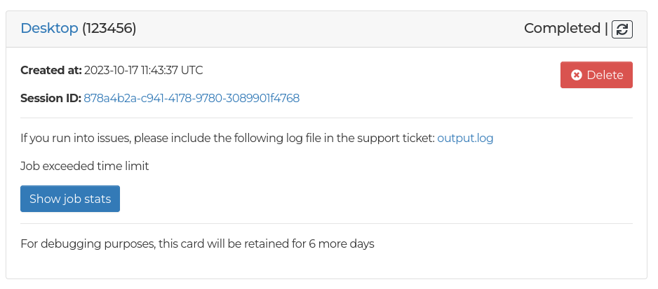

# Interactive applications

The interactive applications run on compute nodes, but are accessed through the web interface.
You will find shortcuts for selected applications on the front page after logging in, and a complete list of applications in the top navbar under _Apps_.

Currently running and past interactive app sessions can be found on the _My Interactive Sessions_ page, which you will find in the navbar in the center.

## Launching an application

Each application has a form with settings for launching, where you can select the project for billing, the partition, resources, and app-specific settings.

The following settings available for most apps:

- **Project:** The project to use for billing for the Slurm job.
- **Partition:** The Slurm partition used.
    Some apps have a limited set of partitions available.
    The partition select may affect what other fields in the form are visible.
    Selecting a GPU partition will allocate one A40 GPU in the `lumid` partition, and one MI250 GCD in the other GPU partitions.
    For the majority of the apps, you should use the `interactive` partition.
- **Reservation:** The Slurm reservation to use for the resource allocation.
    The reservation field is only visible if you have access to an active reservation.
- **CPU cores:** The number of physical CPU cores to allocate.
    As SMT is enabled, two threads per core will be allocated.
- **Memory:** The amount of memory in GB to allocate.
    For some partitions, this is not visible as a certain amount of memory is allocated per CPU core instead.
- **Local disk:** The amount of local disk storage in GB to allocate for apps on LUMI-D nodes.
- **Time:** The wall-clock duration your app will run.

To ensure short queueing times, only request the amount of resources and time you need.

After filling in the form, you can launch the application using the *Launch* button at the bottom of the form.
You will then be redirected to the interactive sessions page, where all of your current and past sessions will be visible.

## Slurm queue

The apps run as normal Slurm jobs, which means that they will queue until resources have been allocated for the Slurm job.
Once the app has started, the app card will become green, and you will see a button to connect to the session.
You can see the status of the application in the top-right corner of the app card, as well as other information about the app.
If you no longer need the session, you should use the *Cancel* button in the app card, which will cancel the Slurm job.

## Completion

After the job completes, the reason for job completion will be visible.
Usually this is due to reaching the time limit of the Slurm job, or manually cancelling the session, but some error messages may also be visible here, with additional details available in the log file linked.
If you are sending a support ticket regarding your app session, please include the log file.

