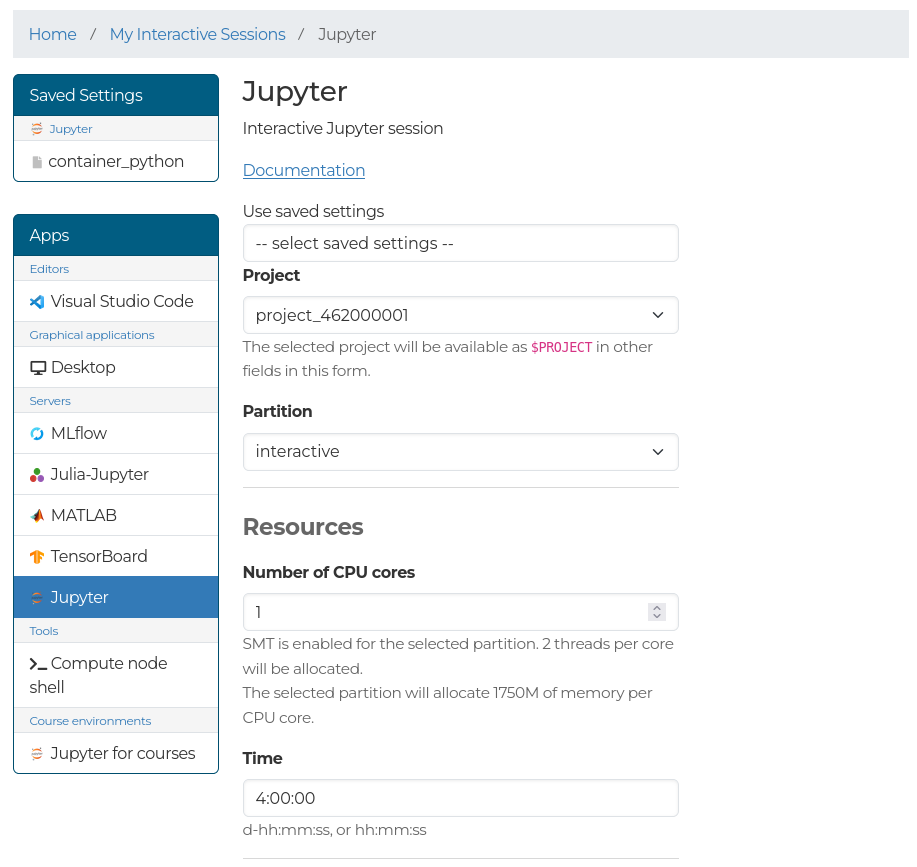
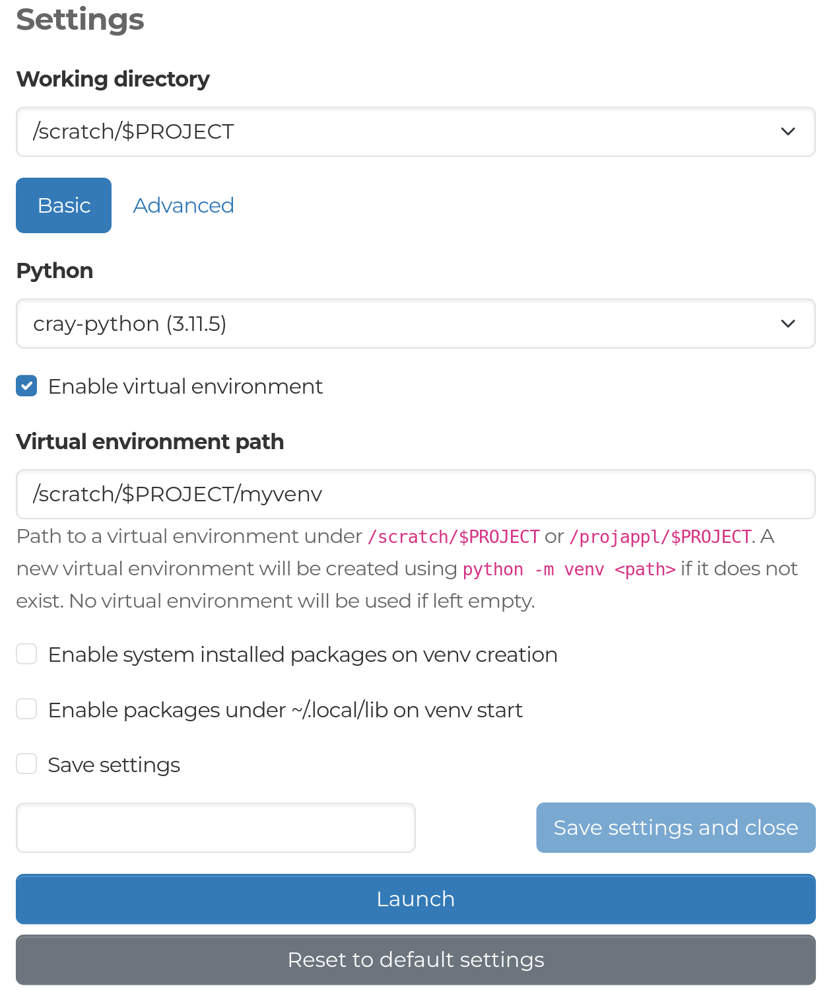
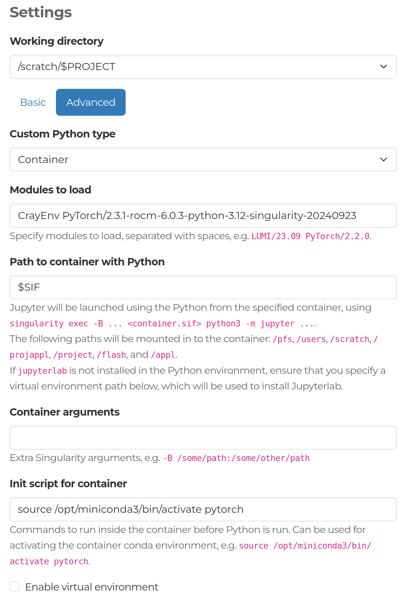

The Jupyter app launches Jupyter Lab on a LUMI compute node, which you can access from the web interface.

In the form you will be able to select:

- **Working directory:** The directory where your notebook file is stored.
- **Basic or Advanced:** 
  The _Basic_ setting allows you to use a Python module provided by the system, with either a virtual environment or user-installed packages to extend the module.
  The _Advanced_ setting lets you set up the Python environment either using a script or a path to a script, as well as use a containerized Python installation.
  For more details about these, see the sections below.

## Basic

In the basic settings, the following settings are available:

- **Python**:
    Currently, the following Python modules are available: `cray-python`,
    `pytorch`, and `geoconda`. Note that `pytorch` and `geoconda` have limited
    support available. You can also select _Custom_ to provide a full path to
    the Python interpreter you want to use.
- **Virtual environment:**
    After enabling the use of virtual environment in the form, you can provide
    a path to your virtual environment. If the provided path does not exist, a
    new virtual environment using the module, or Python interpreter, selected
    will be created. If an already existing path is provided, that virtual
    environment will be used. Note that virtual environments created outside
    the web interface are not guaranteed to work, so creating your virtual
    environments in the web interface is recommended. If the field is left
    empty, no virtual environment is created or used.
- **Enable system installed packages on venv creation:**
    If you are basing your Python virtual environment on an existing Python
    module, you should enable this setting to ensure that you are able to use
    the Python packages provided by the module. If you are creating a Python
    environment, and are only using the modules to provide a specific Python
    version, you can disable this setting.
- **Enable packages under ~/.local/lib on venv start**:
    Enables using packages installed using `pip --user install` in virtual
    environments. It is recommended to leave this disabled to avoid conflicts
    in package versions.

## Advanced

In the advanced settings, you can find a dropdown to specify the method for
customizing your Python environment:

- **Script:**
    Enter the full script or a path to a script for setting up the environment
    to run JupyterLab in the text box. To ensure that Jupyter launches
    correctly, ensure that `python` is available on the path, and the
    `jupyterlab` package has been installed. Jupyter will be launched using the
    command `python -m jupyter lab`.
- **Container:**
    Allows you to use a containerized Python installation. You can can specify
    a list of modules to load before entering the container, the path to your
    container, additional container launch arguments, as well as an
    initialization script for the container. A virtual environment can also be
    used.

