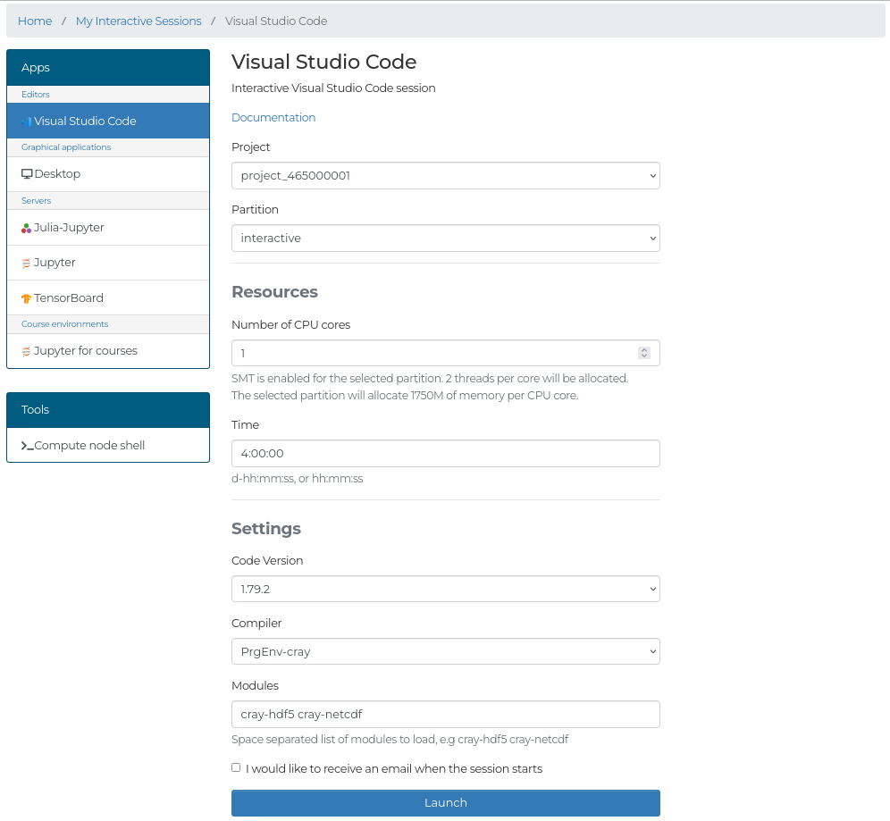

# Visual Studio Code

The Visual Studio Code interactive app can be used for editing and running code on LUMI.

In the form you will be able to select:

- **Code Version:** The version of VSCode to launch.
    Using the latest version is recommended to ensure that extensions are supported.
- **Compiler:** The compiler to use for compiling.
- **Modules:** A list of the modules you want loaded, separated by spaces. Loading modules after VSCode has launched does not work for most functionality in VSCode, so ensure that you have listed all modules before launching the app.

## Extensions
Extensions for Python, C/C++ and Julia are installed by default and do not need to be manually installed.
For other extensions, you can install them in the Extensions tab in VSCode.
Remember to load the correct modules for the extensions before launching the app.
