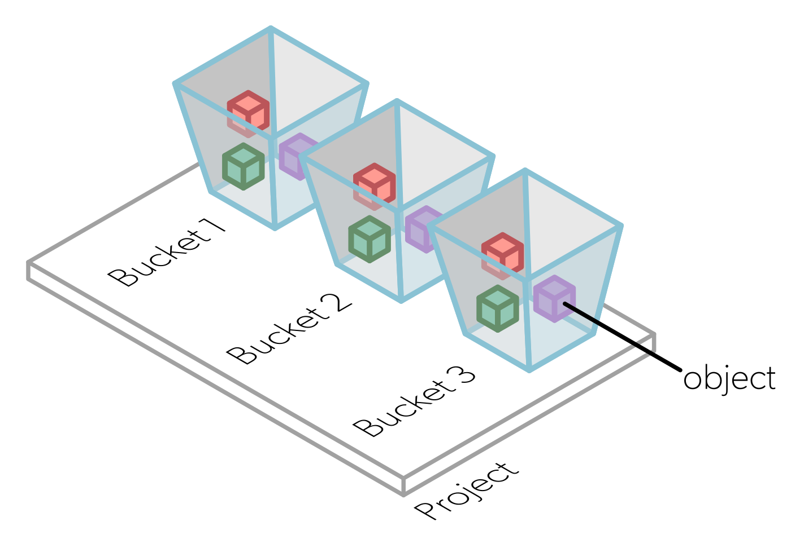

# LUMI-O: The Object Storage

!!! warning
    This page is about a partition that is not yet available

In an object-based storage, data are managed as objects instead of being 
organized as files in a directory hierarchy. 

<!-- This partition may be used for storing, sharing and
staging your data. It's based on Ceph and has a storage capacity of 30 PB. -->

Within your object storage project space, you can create buckets. These 
buckets will store objects with metadata associated to these objects. 

<figure>
  
</figure>

- **Buckets**: Containers used to store one or more objects. You can see a 
  bucket as a directory. However, object storage use a flat structure with only 
  one level which means that buckets cannot contain other buckets.
- **Objects**: Any type of data. An object is stored in a bucket.
- **Metadata**: Key value pairs associated with an object. While traditional 
  file systems have fixed metadata (filename, creation date, type, etc.), an 
  object storage allows you to add custom metadata.

<!-- Each object includes the data, the metadata and a
globally unique identifier.  -->