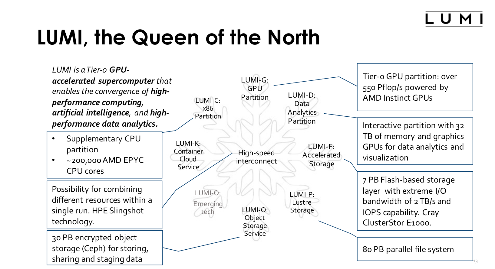

## LUMI

LUMI is one of the three European pre-exascale supercomputers
 
## LUMI Partitions

LUMI comes with different partitions to meet the new challenges the European HPC community will face in the near future

 

